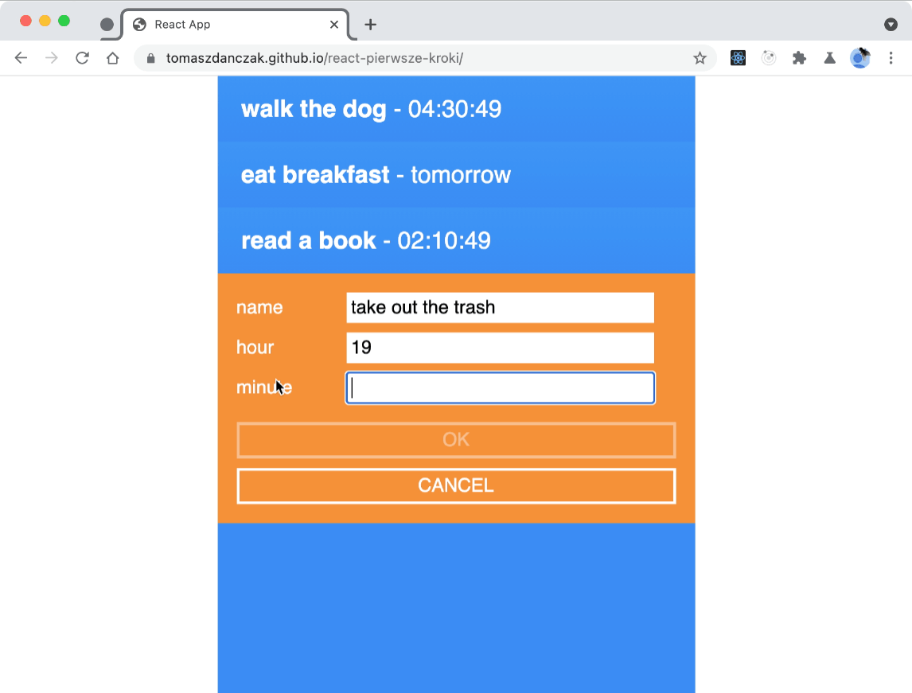
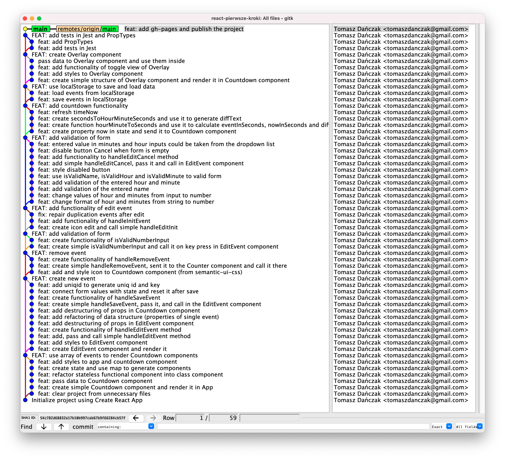

# 🌱 This is my work with [React. Pierwsze kroki](https://helion.pl/ksiazki/react-pierwsze-kroki-kurs-video-tworzenie-praktycznej-aplikacji-jakub-cioslowski,reactk.htm#format/w) by Jakub Cisłowski

  


See [Live 🚀](https://tomaszdanczak.github.io/react-pierwsze-kroki/)   

There is [original repository](https://github.com/jakub-c/videopoint-react-pierwsze-kroki) with code from the course.  

## 1. Thinks I learned
- 🌱 How to keep state of form in React Component
- 🌱 How to create controlled components
- 🌱 How to validate forms
- 🌱 How to read state from localStorage and save it there
- 🌱 How to implement counting in components
## 2. Things I did myself
### 2.1 I built clear Git history
  

### 2.2 I introduced props destructuring in stateless functional components to simplify using props values
```js
const EditEvent = ({onInputChange}) => {

}
```
### 2.3 I implemented destructuring of state in statefull class components
```js
class App extends Component {
  state = {
    editedEvent: {
      id: uniqid(),
      name: "",
      hour: -1,
      minute: -1,
    },
  }
  render() {
    const { name, hour, minute } = this.state.editedEvent;
   
    return ()
  }
}
```
### 2.4 I implemented arrow functiions instead function declaration 
So I didn't have to use bind method in constructor. Also I didn't use constructor and used simple state:
```js
class App extends Component {
  state = {
    
  }
  render() {
    return ()
  }
}
```
### 2.5 I used spread operator instead Object.assign to merge objects
```js
return { editedEvent: { ...prevState.editedEvent, ...val}}
```
